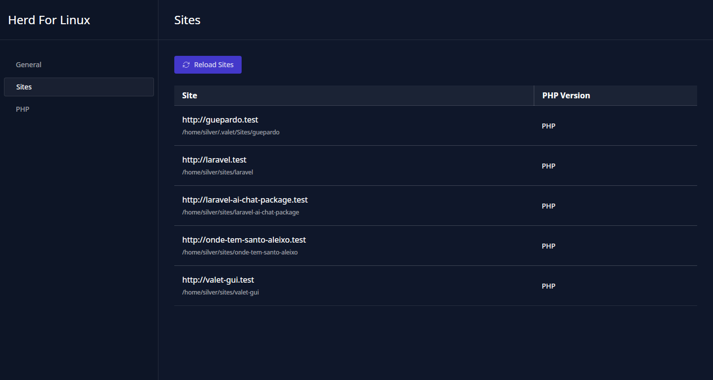

# Herd For Linux

This is a Valet Graphical User Interface (GUI) for Linux using [Tauri](https://tauri.app/) and [Vue](https://vuejs.org/). Its meant to be a simple and easy to use GUI for Valet while Herd is still in development.

It is a work in progress and is not yet ready for production use.

## Todo

- [x] Sites tab (WIP)
- [ ] General
- [ ] PHP tab
- [ ] Settings tab
